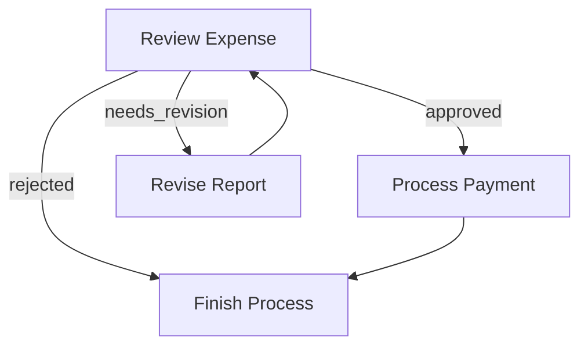
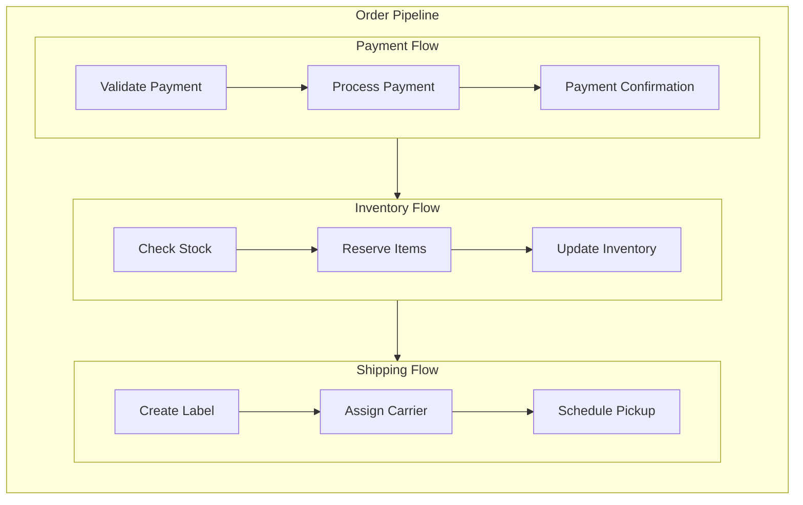

# Daily Paper V2 Project Context

## Project Overview
This is a Daily Paper Processing System built on the PocketFlow framework - an automated system for fetching, analyzing, and sharing academic papers.

### Core Functionality
- **Paper Fetching**: Automatically retrieves latest papers from arXiv by topic
- **Smart Filtering**: Filters already processed papers and optionally filters irrelevant papers using LLM
- **Analysis & Summarization**: Uses LLM to generate paper summaries using configurable templates
- **Automated Sharing**: Pushes papers and summaries to Feishu (Lark) groups
- **Template System**: Configurable analysis templates for different output formats

### Key Components
- **Nodes**: Individual processing units (fetch, filter, process, push)
- **Templates**: Configurable analysis templates (v1, v2, simple)
- **Utilities**: ArXiv client, PDF processor, Feishu client, data manager, LLM wrapper
- **Data Storage**: Uses parquet files for paper metadata persistence
- **Configuration**: YAML-based configuration system

### Architecture
Built using PocketFlow framework following the "Graph + Shared Store" pattern:
- Nodes handle specific tasks (fetch → filter → process → push)
- Shared store manages data flow between nodes
- Template system provides flexible output formatting
- Batch processing for handling multiple papers efficiently

### Current Status
- Supports RAG and Knowledge Graph paper categories
- Template system with v1, v2, and simple templates
- Optional LLM-based paper relevance filtering
- Feishu integration for team sharing
- Comprehensive logging and error handling

## Usage
```bash
# Run full workflow (default)
python main.py --config_path config/rag.yaml --mode full

# Run summary-only workflow (fetch + filter + process, no pushing)
python main.py --config_path config/rag.yaml --mode summary

# Run publish-only workflow (push existing summaries to Feishu/RSS/GitHub)
python main.py --config_path config/rag.yaml --mode publish

# Available configs: rag.yaml, kg.yaml, test.yaml
# Available modes: full (default), summary, publish
```

# Agentic Coding: Humans Design, Agents code!

> If you are an AI agent involved in building LLM Systems, read this guide **VERY, VERY** carefully! This is the most important chapter in the entire document. Throughout development, you should always (1) start with a small and simple solution, (2) design at a high level (`docs/design.md`) before implementation, and (3) frequently ask humans for feedback and clarification.
{: .warning }

## Agentic Coding Steps

Agentic Coding should be a collaboration between Human System Design and Agent Implementation:

| Steps                  | Human      | AI        | Comment                                                                 |
|:-----------------------|:----------:|:---------:|:------------------------------------------------------------------------|
| 1. Requirements | ★★★ High  | ★☆☆ Low   | Humans understand the requirements and context.                    |
| 2. Flow          | ★★☆ Medium | ★★☆ Medium |  Humans specify the high-level design, and the AI fills in the details. |
| 3. Utilities   | ★★☆ Medium | ★★☆ Medium | Humans provide available external APIs and integrations, and the AI helps with implementation. |
| 4. Data          | ★☆☆ Low    | ★★★ High   | AI designs the data schema, and humans verify.                            |
| 5. Node          | ★☆☆ Low   | ★★★ High  | The AI helps design the node based on the flow.          |
| 6. Implementation      | ★☆☆ Low   | ★★★ High  |  The AI implements the flow based on the design. |
| 7. Optimization        | ★★☆ Medium | ★★☆ Medium | Humans evaluate the results, and the AI helps optimize. |
| 8. Reliability         | ★☆☆ Low   | ★★★ High  |  The AI writes test cases and addresses corner cases.     |

1. **Requirements**: Clarify the requirements for your project, and evaluate whether an AI system is a good fit. 
    - Understand AI systems' strengths and limitations:
      - **Good for**: Routine tasks requiring common sense (filling forms, replying to emails)
      - **Good for**: Creative tasks with well-defined inputs (building slides, writing SQL)
      - **Not good for**: Ambiguous problems requiring complex decision-making (business strategy, startup planning)
    - **Keep It User-Centric:** Explain the "problem" from the user's perspective rather than just listing features.
    - **Balance complexity vs. impact**: Aim to deliver the highest value features with minimal complexity early.

2. **Flow Design**: Outline at a high level, describe how your AI system orchestrates nodes.
    - Identify applicable design patterns (e.g., [Map Reduce](./design_pattern/mapreduce.md), [Agent](./design_pattern/agent.md), [RAG](./design_pattern/rag.md)).
      - For each node in the flow, start with a high-level one-line description of what it does.
      - If using **Map Reduce**, specify how to map (what to split) and how to reduce (how to combine).
      - If using **Agent**, specify what are the inputs (context) and what are the possible actions.
      - If using **RAG**, specify what to embed, noting that there's usually both offline (indexing) and online (retrieval) workflows.
    - Outline the flow and draw it in a mermaid diagram. For example:
      ```mermaid
      flowchart LR
          start[Start] --> batch[Batch]
          batch --> check[Check]
          check -->|OK| process
          check -->|Error| fix[Fix]
          fix --> check
          
          subgraph process[Process]
            step1[Step 1] --> step2[Step 2]
          end
          
          process --> endNode[End]
      ```
    - > **If Humans can't specify the flow, AI Agents can't automate it!** Before building an LLM system, thoroughly understand the problem and potential solution by manually solving example inputs to develop intuition.  
      {: .best-practice }

3. **Utilities**: Based on the Flow Design, identify and implement necessary utility functions.
    - Think of your AI system as the brain. It needs a body—these *external utility functions*—to interact with the real world:
        <div align="center"></div>

        - Reading inputs (e.g., retrieving Slack messages, reading emails)
        - Writing outputs (e.g., generating reports, sending emails)
        - Using external tools (e.g., calling LLMs, searching the web)
        - **NOTE**: *LLM-based tasks* (e.g., summarizing text, analyzing sentiment) are **NOT** utility functions; rather, they are *core functions* internal in the AI system.
    - For each utility function, implement it and write a simple test.
    - Document their input/output, as well as why they are necessary. For example:
      - `name`: `get_embedding` (`utils/get_embedding.py`)
      - `input`: `str`
      - `output`: a vector of 3072 floats
      - `necessity`: Used by the second node to embed text
    - Example utility implementation:
      ```python
      # utils/call_llm.py
      from openai import OpenAI

      def call_llm(prompt):    
          client = OpenAI(api_key="YOUR_API_KEY_HERE")
          r = client.chat.completions.create(
              model="gpt-4o",
              messages=[{"role": "user", "content": prompt}]
          )
          return r.choices[0].message.content
          
      if __name__ == "__main__":
          prompt = "What is the meaning of life?"
          print(call_llm(prompt))
      ```
    - > **Sometimes, design Utilities before Flow:**  For example, for an LLM project to automate a legacy system, the bottleneck will likely be the available interface to that system. Start by designing the hardest utilities for interfacing, and then build the flow around them.
      {: .best-practice }
    - > **Avoid Exception Handling in Utilities**: If a utility function is called from a Node's `exec()` method, avoid using `try...except` blocks within the utility. Let the Node's built-in retry mechanism handle failures.
      {: .warning }

4. **Data Design**: Design the shared store that nodes will use to communicate.
   - One core design principle for PocketFlow is to use a well-designed [shared store](./core_abstraction/communication.md)—a data contract that all nodes agree upon to retrieve and store data.
      - For simple systems, use an in-memory dictionary.
      - For more complex systems or when persistence is required, use a database.
      - **Don't Repeat Yourself**: Use in-memory references or foreign keys.
      - Example shared store design:
        ```python
        shared = {
            "user": {
                "id": "user123",
                "context": {                # Another nested dict
                    "weather": {"temp": 72, "condition": "sunny"},
                    "location": "San Francisco"
                }
            },
            "results": {}                   # Empty dict to store outputs
        }
        ```

5. **Node Design**: Plan how each node will read and write data, and use utility functions.
   - For each [Node](./core_abstraction/node.md), describe its type, how it reads and writes data, and which utility function it uses. Keep it specific but high-level without codes. For example:
     - `type`: Regular (or Batch, or Async)
     - `prep`: Read "text" from the shared store
     - `exec`: Call the embedding utility function. **Avoid exception handling here**; let the Node's retry mechanism manage failures.
     - `post`: Write "embedding" to the shared store

6. **Implementation**: Implement the initial nodes and flows based on the design.
   - 🎉 If you've reached this step, humans have finished the design. Now *Agentic Coding* begins!
   - **"Keep it simple, stupid!"** Avoid complex features and full-scale type checking.
   - **FAIL FAST**! Leverage the built-in [Node](./core_abstraction/node.md) retry and fallback mechanisms to handle failures gracefully. This helps you quickly identify weak points in the system.
   - Add logging throughout the code to facilitate debugging.

7. **Optimization**:
   - **Use Intuition**: For a quick initial evaluation, human intuition is often a good start.
   - **Redesign Flow (Back to Step 3)**: Consider breaking down tasks further, introducing agentic decisions, or better managing input contexts.
   - If your flow design is already solid, move on to micro-optimizations:
     - **Prompt Engineering**: Use clear, specific instructions with examples to reduce ambiguity.
     - **In-Context Learning**: Provide robust examples for tasks that are difficult to specify with instructions alone.

   - > **You'll likely iterate a lot!** Expect to repeat Steps 3–6 hundreds of times.
     >
     > <div align="center"></div>
     {: .best-practice }

8. **Reliability**  
   - **Node Retries**: Add checks in the node `exec` to ensure outputs meet requirements, and consider increasing `max_retries` and `wait` times.
   - **Logging and Visualization**: Maintain logs of all attempts and visualize node results for easier debugging.
   - **Self-Evaluation**: Add a separate node (powered by an LLM) to review outputs when results are uncertain.

## Example LLM Project File Structure

```
my_project/
├── main.py
├── nodes.py
├── flow.py
├── utils/
│   ├── __init__.py
│   ├── call_llm.py
│   └── search_web.py
├── requirements.txt
└── docs/
    └── design.md
```

- **`docs/design.md`**: Contains project documentation for each step above. This should be *high-level* and *no-code*.
- **`utils/`**: Contains all utility functions.
  - It's recommended to dedicate one Python file to each API call, for example `call_llm.py` or `search_web.py`.
  - Each file should also include a `main()` function to try that API call
- **`nodes.py`**: Contains all the node definitions.
  ```python
  # nodes.py
  from pocketflow import Node
  from utils.call_llm import call_llm

  class GetQuestionNode(Node):
      def exec(self, _):
          # Get question directly from user input
          user_question = input("Enter your question: ")
          return user_question
      
      def post(self, shared, prep_res, exec_res):
          # Store the user's question
          shared["question"] = exec_res
          return "default"  # Go to the next node

  class AnswerNode(Node):
      def prep(self, shared):
          # Read question from shared
          return shared["question"]
      
      def exec(self, question):
          # Call LLM to get the answer
          return call_llm(question)
      
      def post(self, shared, prep_res, exec_res):
          # Store the answer in shared
          shared["answer"] = exec_res
  ```
- **`flow.py`**: Implements functions that create flows by importing node definitions and connecting them.
  ```python
  # flow.py
  from pocketflow import Flow
  from nodes import GetQuestionNode, AnswerNode

  def create_qa_flow():
      """Create and return a question-answering flow."""
      # Create nodes
      get_question_node = GetQuestionNode()
      answer_node = AnswerNode()
      
      # Connect nodes in sequence
      get_question_node >> answer_node
      
      # Create flow starting with input node
      return Flow(start=get_question_node)
  ```
- **`main.py`**: Serves as the project's entry point.
  ```python
  # main.py
  from flow import create_qa_flow

  # Example main function
  # Please replace this with your own main function
  def main():
      shared = {
          "question": None,  # Will be populated by GetQuestionNode from user input
          "answer": None     # Will be populated by AnswerNode
      }

      # Create the flow and run it
      qa_flow = create_qa_flow()
      qa_flow.run(shared)
      print(f"Question: {shared['question']}")
      print(f"Answer: {shared['answer']}")

  if __name__ == "__main__":
      main()
  ```

================================================
File: docs/index.md
================================================
---
layout: default
title: "Home"
nav_order: 1
---

# Pocket Flow

A [100-line](https://github.com/the-pocket/PocketFlow/blob/main/pocketflow/__init__.py) minimalist LLM framework for *Agents, Task Decomposition, RAG, etc*.

- **Lightweight**: Just the core graph abstraction in 100 lines. ZERO dependencies, and vendor lock-in.
- **Expressive**: Everything you love from larger frameworks—([Multi-](./design_pattern/multi_agent.html))[Agents](./design_pattern/agent.html), [Workflow](./design_pattern/workflow.html), [RAG](./design_pattern/rag.html), and more.  
- **Agentic-Coding**: Intuitive enough for AI agents to help humans build complex LLM applications.

<div align="center">
  
</div>

## Core Abstraction

We model the LLM workflow as a **Graph + Shared Store**:

- [Node](./core_abstraction/node.md) handles simple (LLM) tasks.
- [Flow](./core_abstraction/flow.md) connects nodes through **Actions** (labeled edges).
- [Shared Store](./core_abstraction/communication.md) enables communication between nodes within flows.
- [Batch](./core_abstraction/batch.md) nodes/flows allow for data-intensive tasks.
- [Async](./core_abstraction/async.md) nodes/flows allow waiting for asynchronous tasks.
- [(Advanced) Parallel](./core_abstraction/parallel.md) nodes/flows handle I/O-bound tasks.

<div align="center">
  
</div>

## Design Pattern

From there, it’s easy to implement popular design patterns:

- [Agent](./design_pattern/agent.md) autonomously makes decisions.
- [Workflow](./design_pattern/workflow.md) chains multiple tasks into pipelines.
- [RAG](./design_pattern/rag.md) integrates data retrieval with generation.
- [Map Reduce](./design_pattern/mapreduce.md) splits data tasks into Map and Reduce steps.
- [Structured Output](./design_pattern/structure.md) formats outputs consistently.
- [(Advanced) Multi-Agents](./design_pattern/multi_agent.md) coordinate multiple agents.

<div align="center">
  
</div>

## Utility Function

We **do not** provide built-in utilities. Instead, we offer *examples*—please *implement your own*:

- [LLM Wrapper](./utility_function/llm.md)
- [Viz and Debug](./utility_function/viz.md)
- [Web Search](./utility_function/websearch.md)
- [Chunking](./utility_function/chunking.md)
- [Embedding](./utility_function/embedding.md)
- [Vector Databases](./utility_function/vector.md)
- [Text-to-Speech](./utility_function/text_to_speech.md)

**Why not built-in?**: I believe it's a *bad practice* for vendor-specific APIs in a general framework:
- *API Volatility*: Frequent changes lead to heavy maintenance for hardcoded APIs.
- *Flexibility*: You may want to switch vendors, use fine-tuned models, or run them locally.
- *Optimizations*: Prompt caching, batching, and streaming are easier without vendor lock-in.

## Ready to build your Apps? 

Check out [Agentic Coding Guidance](./guide.md), the fastest way to develop LLM projects with Pocket Flow!

================================================
File: docs/core_abstraction/async.md
================================================
---
layout: default
title: "(Advanced) Async"
parent: "Core Abstraction"
nav_order: 5
---

# (Advanced) Async

**Async** Nodes implement `prep_async()`, `exec_async()`, `exec_fallback_async()`, and/or `post_async()`. This is useful for:

1. **prep_async()**: For *fetching/reading data (files, APIs, DB)* in an I/O-friendly way.
2. **exec_async()**: Typically used for async LLM calls.
3. **post_async()**: For *awaiting user feedback*, *coordinating across multi-agents* or any additional async steps after `exec_async()`.

**Note**: `AsyncNode` must be wrapped in `AsyncFlow`. `AsyncFlow` can also include regular (sync) nodes.

### Example

```python
class SummarizeThenVerify(AsyncNode):
    async def prep_async(self, shared):
        # Example: read a file asynchronously
        doc_text = await read_file_async(shared["doc_path"])
        return doc_text

    async def exec_async(self, prep_res):
        # Example: async LLM call
        summary = await call_llm_async(f"Summarize: {prep_res}")
        return summary

    async def post_async(self, shared, prep_res, exec_res):
        # Example: wait for user feedback
        decision = await gather_user_feedback(exec_res)
        if decision == "approve":
            shared["summary"] = exec_res
            return "approve"
        return "deny"

summarize_node = SummarizeThenVerify()
final_node = Finalize()

# Define transitions
summarize_node - "approve" >> final_node
summarize_node - "deny"    >> summarize_node  # retry

flow = AsyncFlow(start=summarize_node)

async def main():
    shared = {"doc_path": "document.txt"}
    await flow.run_async(shared)
    print("Final Summary:", shared.get("summary"))

asyncio.run(main())
```

================================================
File: docs/core_abstraction/batch.md
================================================
---
layout: default
title: "Batch"
parent: "Core Abstraction"
nav_order: 4
---

# Batch

**Batch** makes it easier to handle large inputs in one Node or **rerun** a Flow multiple times. Example use cases:
- **Chunk-based** processing (e.g., splitting large texts).
- **Iterative** processing over lists of input items (e.g., user queries, files, URLs).

## 1. BatchNode

A **BatchNode** extends `Node` but changes `prep()` and `exec()`:

- **`prep(shared)`**: returns an **iterable** (e.g., list, generator).
- **`exec(item)`**: called **once** per item in that iterable.
- **`post(shared, prep_res, exec_res_list)`**: after all items are processed, receives a **list** of results (`exec_res_list`) and returns an **Action**.


### Example: Summarize a Large File

```python
class MapSummaries(BatchNode):
    def prep(self, shared):
        # Suppose we have a big file; chunk it
        content = shared["data"]
        chunk_size = 10000
        chunks = [content[i:i+chunk_size] for i in range(0, len(content), chunk_size)]
        return chunks

    def exec(self, chunk):
        prompt = f"Summarize this chunk in 10 words: {chunk}"
        summary = call_llm(prompt)
        return summary

    def post(self, shared, prep_res, exec_res_list):
        combined = "\n".join(exec_res_list)
        shared["summary"] = combined
        return "default"

map_summaries = MapSummaries()
flow = Flow(start=map_summaries)
flow.run(shared)
```

---

## 2. BatchFlow

A **BatchFlow** runs a **Flow** multiple times, each time with different `params`. Think of it as a loop that replays the Flow for each parameter set.

### Example: Summarize Many Files

```python
class SummarizeAllFiles(BatchFlow):
    def prep(self, shared):
        # Return a list of param dicts (one per file)
        filenames = list(shared["data"].keys())  # e.g., ["file1.txt", "file2.txt", ...]
        return [{"filename": fn} for fn in filenames]

# Suppose we have a per-file Flow (e.g., load_file >> summarize >> reduce):
summarize_file = SummarizeFile(start=load_file)

# Wrap that flow into a BatchFlow:
summarize_all_files = SummarizeAllFiles(start=summarize_file)
summarize_all_files.run(shared)
```

### Under the Hood
1. `prep(shared)` returns a list of param dicts—e.g., `[{filename: "file1.txt"}, {filename: "file2.txt"}, ...]`.
2. The **BatchFlow** loops through each dict. For each one:
   - It merges the dict with the BatchFlow’s own `params`.
   - It calls `flow.run(shared)` using the merged result.
3. This means the sub-Flow is run **repeatedly**, once for every param dict.

---

## 3. Nested or Multi-Level Batches

You can nest a **BatchFlow** in another **BatchFlow**. For instance:
- **Outer** batch: returns a list of diretory param dicts (e.g., `{"directory": "/pathA"}`, `{"directory": "/pathB"}`, ...).
- **Inner** batch: returning a list of per-file param dicts.

At each level, **BatchFlow** merges its own param dict with the parent’s. By the time you reach the **innermost** node, the final `params` is the merged result of **all** parents in the chain. This way, a nested structure can keep track of the entire context (e.g., directory + file name) at once.

```python

class FileBatchFlow(BatchFlow):
    def prep(self, shared):
        directory = self.params["directory"]
        # e.g., files = ["file1.txt", "file2.txt", ...]
        files = [f for f in os.listdir(directory) if f.endswith(".txt")]
        return [{"filename": f} for f in files]

class DirectoryBatchFlow(BatchFlow):
    def prep(self, shared):
        directories = [ "/path/to/dirA", "/path/to/dirB"]
        return [{"directory": d} for d in directories]

# MapSummaries have params like {"directory": "/path/to/dirA", "filename": "file1.txt"}
inner_flow = FileBatchFlow(start=MapSummaries())
outer_flow = DirectoryBatchFlow(start=inner_flow)
```

================================================
File: docs/core_abstraction/communication.md
================================================
---
layout: default
title: "Communication"
parent: "Core Abstraction"
nav_order: 3
---

# Communication

Nodes and Flows **communicate** in 2 ways:

1. **Shared Store (for almost all the cases)** 

   - A global data structure (often an in-mem dict) that all nodes can read ( `prep()`) and write (`post()`).  
   - Great for data results, large content, or anything multiple nodes need.
   - You shall design the data structure and populate it ahead.
     
   - > **Separation of Concerns:** Use `Shared Store` for almost all cases to separate *Data Schema* from *Compute Logic*!  This approach is both flexible and easy to manage, resulting in more maintainable code. `Params` is more a syntax sugar for [Batch](./batch.md).
     {: .best-practice }

2. **Params (only for [Batch](./batch.md))** 
   - Each node has a local, ephemeral `params` dict passed in by the **parent Flow**, used as an identifier for tasks. Parameter keys and values shall be **immutable**.
   - Good for identifiers like filenames or numeric IDs, in Batch mode.

If you know memory management, think of the **Shared Store** like a **heap** (shared by all function calls), and **Params** like a **stack** (assigned by the caller).

---

## 1. Shared Store

### Overview

A shared store is typically an in-mem dictionary, like:
```python
shared = {"data": {}, "summary": {}, "config": {...}, ...}
```

It can also contain local file handlers, DB connections, or a combination for persistence. We recommend deciding the data structure or DB schema first based on your app requirements.

### Example

```python
class LoadData(Node):
    def post(self, shared, prep_res, exec_res):
        # We write data to shared store
        shared["data"] = "Some text content"
        return None

class Summarize(Node):
    def prep(self, shared):
        # We read data from shared store
        return shared["data"]

    def exec(self, prep_res):
        # Call LLM to summarize
        prompt = f"Summarize: {prep_res}"
        summary = call_llm(prompt)
        return summary

    def post(self, shared, prep_res, exec_res):
        # We write summary to shared store
        shared["summary"] = exec_res
        return "default"

load_data = LoadData()
summarize = Summarize()
load_data >> summarize
flow = Flow(start=load_data)

shared = {}
flow.run(shared)
```

Here:
- `LoadData` writes to `shared["data"]`.
- `Summarize` reads from `shared["data"]`, summarizes, and writes to `shared["summary"]`.

---

## 2. Params

**Params** let you store *per-Node* or *per-Flow* config that doesn't need to live in the shared store. They are:
- **Immutable** during a Node's run cycle (i.e., they don't change mid-`prep->exec->post`).
- **Set** via `set_params()`.
- **Cleared** and updated each time a parent Flow calls it.

> Only set the uppermost Flow params because others will be overwritten by the parent Flow. 
> 
> If you need to set child node params, see [Batch](./batch.md).
{: .warning }

Typically, **Params** are identifiers (e.g., file name, page number). Use them to fetch the task you assigned or write to a specific part of the shared store.

### Example

```python
# 1) Create a Node that uses params
class SummarizeFile(Node):
    def prep(self, shared):
        # Access the node's param
        filename = self.params["filename"]
        return shared["data"].get(filename, "")

    def exec(self, prep_res):
        prompt = f"Summarize: {prep_res}"
        return call_llm(prompt)

    def post(self, shared, prep_res, exec_res):
        filename = self.params["filename"]
        shared["summary"][filename] = exec_res
        return "default"

# 2) Set params
node = SummarizeFile()

# 3) Set Node params directly (for testing)
node.set_params({"filename": "doc1.txt"})
node.run(shared)

# 4) Create Flow
flow = Flow(start=node)

# 5) Set Flow params (overwrites node params)
flow.set_params({"filename": "doc2.txt"})
flow.run(shared)  # The node summarizes doc2, not doc1
```

================================================
File: docs/core_abstraction/flow.md
================================================
---
layout: default
title: "Flow"
parent: "Core Abstraction"
nav_order: 2
---

# Flow

A **Flow** orchestrates a graph of Nodes. You can chain Nodes in a sequence or create branching depending on the **Actions** returned from each Node's `post()`.

## 1. Action-based Transitions

Each Node's `post()` returns an **Action** string. By default, if `post()` doesn't return anything, we treat that as `"default"`.

You define transitions with the syntax:

1. **Basic default transition**: `node_a >> node_b`
  This means if `node_a.post()` returns `"default"`, go to `node_b`. 
  (Equivalent to `node_a - "default" >> node_b`)

2. **Named action transition**: `node_a - "action_name" >> node_b`
  This means if `node_a.post()` returns `"action_name"`, go to `node_b`.

It's possible to create loops, branching, or multi-step flows.

## 2. Creating a Flow

A **Flow** begins with a **start** node. You call `Flow(start=some_node)` to specify the entry point. When you call `flow.run(shared)`, it executes the start node, looks at its returned Action from `post()`, follows the transition, and continues until there's no next node.

### Example: Simple Sequence

Here's a minimal flow of two nodes in a chain:

```python
node_a >> node_b
flow = Flow(start=node_a)
flow.run(shared)
```

- When you run the flow, it executes `node_a`.  
- Suppose `node_a.post()` returns `"default"`.  
- The flow then sees `"default"` Action is linked to `node_b` and runs `node_b`.  
- `node_b.post()` returns `"default"` but we didn't define `node_b >> something_else`. So the flow ends there.

### Example: Branching & Looping

Here's a simple expense approval flow that demonstrates branching and looping. The `ReviewExpense` node can return three possible Actions:

- `"approved"`: expense is approved, move to payment processing
- `"needs_revision"`: expense needs changes, send back for revision 
- `"rejected"`: expense is denied, finish the process

We can wire them like this:

```python
# Define the flow connections
review - "approved" >> payment        # If approved, process payment
review - "needs_revision" >> revise   # If needs changes, go to revision
review - "rejected" >> finish         # If rejected, finish the process

revise >> review   # After revision, go back for another review
payment >> finish  # After payment, finish the process

flow = Flow(start=review)
```

Let's see how it flows:

1. If `review.post()` returns `"approved"`, the expense moves to the `payment` node
2. If `review.post()` returns `"needs_revision"`, it goes to the `revise` node, which then loops back to `review`
3. If `review.post()` returns `"rejected"`, it moves to the `finish` node and stops



### Running Individual Nodes vs. Running a Flow

- `node.run(shared)`: Just runs that node alone (calls `prep->exec->post()`), returns an Action. 
- `flow.run(shared)`: Executes from the start node, follows Actions to the next node, and so on until the flow can't continue.

> `node.run(shared)` **does not** proceed to the successor.
> This is mainly for debugging or testing a single node.
> 
> Always use `flow.run(...)` in production to ensure the full pipeline runs correctly.
{: .warning }

## 3. Nested Flows

A **Flow** can act like a Node, which enables powerful composition patterns. This means you can:

1. Use a Flow as a Node within another Flow's transitions.  
2. Combine multiple smaller Flows into a larger Flow for reuse.  
3. Node `params` will be a merging of **all** parents' `params`.

### Flow's Node Methods

A **Flow** is also a **Node**, so it will run `prep()` and `post()`. However:

- It **won't** run `exec()`, as its main logic is to orchestrate its nodes.
- `post()` always receives `None` for `exec_res` and should instead get the flow execution results from the shared store.

### Basic Flow Nesting

Here's how to connect a flow to another node:

```python
# Create a sub-flow
node_a >> node_b
subflow = Flow(start=node_a)

# Connect it to another node
subflow >> node_c

# Create the parent flow
parent_flow = Flow(start=subflow)
```

When `parent_flow.run()` executes:
1. It starts `subflow`
2. `subflow` runs through its nodes (`node_a->node_b`)
3. After `subflow` completes, execution continues to `node_c`

### Example: Order Processing Pipeline

Here's a practical example that breaks down order processing into nested flows:

```python
# Payment processing sub-flow
validate_payment >> process_payment >> payment_confirmation
payment_flow = Flow(start=validate_payment)

# Inventory sub-flow
check_stock >> reserve_items >> update_inventory
inventory_flow = Flow(start=check_stock)

# Shipping sub-flow
create_label >> assign_carrier >> schedule_pickup
shipping_flow = Flow(start=create_label)

# Connect the flows into a main order pipeline
payment_flow >> inventory_flow >> shipping_flow

# Create the master flow
order_pipeline = Flow(start=payment_flow)

# Run the entire pipeline
order_pipeline.run(shared_data)
```

This creates a clean separation of concerns while maintaining a clear execution path:



================================================
File: docs/core_abstraction/node.md
================================================
---
layout: default
title: "Node"
parent: "Core Abstraction"
nav_order: 1
---

# Node

A **Node** is the smallest building block. Each Node has 3 steps `prep->exec->post`:

<div align="center">
  
</div>

1. `prep(shared)`
   - **Read and preprocess data** from `shared` store. 
   - Examples: *query DB, read files, or serialize data into a string*.
   - Return `prep_res`, which is used by `exec()` and `post()`.

2. `exec(prep_res)`
   - **Execute compute logic**, with optional retries and error handling (below).
   - Examples: *(mostly) LLM calls, remote APIs, tool use*.
   - ⚠️ This shall be only for compute and **NOT** access `shared`.
   - ⚠️ If retries enabled, ensure idempotent implementation.
   - ⚠️ Defer exception handling to the Node's built-in retry mechanism.
   - Return `exec_res`, which is passed to `post()`.

3. `post(shared, prep_res, exec_res)`
   - **Postprocess and write data** back to `shared`.
   - Examples: *update DB, change states, log results*.
   - **Decide the next action** by returning a *string* (`action = "default"` if *None*).

> **Why 3 steps?** To enforce the principle of *separation of concerns*. The data storage and data processing are operated separately.
>
> All steps are *optional*. E.g., you can only implement `prep` and `post` if you just need to process data.
{: .note }

### Fault Tolerance & Retries

You can **retry** `exec()` if it raises an exception via two parameters when define the Node:

- `max_retries` (int): Max times to run `exec()`. The default is `1` (**no** retry).
- `wait` (int): The time to wait (in **seconds**) before next retry. By default, `wait=0` (no waiting). 
`wait` is helpful when you encounter rate-limits or quota errors from your LLM provider and need to back off.

```python 
my_node = SummarizeFile(max_retries=3, wait=10)
```

When an exception occurs in `exec()`, the Node automatically retries until:

- It either succeeds, or
- The Node has retried `max_retries - 1` times already and fails on the last attempt.

You can get the current retry times (0-based) from `self.cur_retry`.

```python 
class RetryNode(Node):
    def exec(self, prep_res):
        print(f"Retry {self.cur_retry} times")
        raise Exception("Failed")
```

### Graceful Fallback

To **gracefully handle** the exception (after all retries) rather than raising it, override:

```python 
def exec_fallback(self, prep_res, exc):
    raise exc
```

By default, it just re-raises exception. But you can return a fallback result instead, which becomes the `exec_res` passed to `post()`.

### Example: Summarize file

```python 
class SummarizeFile(Node):
    def prep(self, shared):
        return shared["data"]

    def exec(self, prep_res):
        if not prep_res:
            return "Empty file content"
        prompt = f"Summarize this text in 10 words: {prep_res}"
        summary = call_llm(prompt)  # might fail
        return summary

    def exec_fallback(self, prep_res, exc):
        # Provide a simple fallback instead of crashing
        return "There was an error processing your request."

    def post(self, shared, prep_res, exec_res):
        shared["summary"] = exec_res
        # Return "default" by not returning

summarize_node = SummarizeFile(max_retries=3)

# node.run() calls prep->exec->post
# If exec() fails, it retries up to 3 times before calling exec_fallback()
action_result = summarize_node.run(shared)

print("Action returned:", action_result)  # "default"
print("Summary stored:", shared["summary"])
```

================================================
File: docs/core_abstraction/parallel.md
================================================
---
layout: default
title: "(Advanced) Parallel"
parent: "Core Abstraction"
nav_order: 6
---
