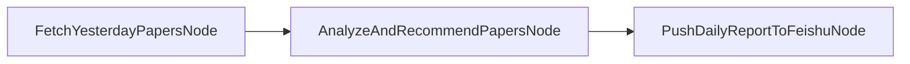

# Daily Paper Report Design Document

## 1. 需求分析 (Requirements)

### 功能概述
实现一个昨日论文报告功能，用于生成前一天更新的论文总结报告，并提供智能推荐功能。

### 核心需求
- **数据筛选**: 从paper manager中获取`update_time`为昨天的论文
- **智能总结**: 基于这些论文的summary进行综合分析和总结  
- **推荐系统**: 从昨日论文中推荐top-X篇最值得关注的论文
- **报告生成**: 生成结构化的昨日论文报告
- **多渠道分发**: 支持推送到飞书、RSS等渠道

### 用户价值
- 快速了解昨日论文动态和趋势
- 获得精准的论文推荐，节省筛选时间
- 保持对研究领域的持续跟进

## 2. 系统设计 (Flow Design)

### 整体架构
基于现有PocketFlow框架，采用"Graph + Shared Store"模式，简化为3个核心节点：


### 核心节点设计

1. **FetchYesterdayPapersNode**: 获取昨日论文
   - 从PaperMetaManager获取昨天的论文数据
   - 过滤出有有效summary的论文

2. **AnalyzeAndRecommendPapersNode**: 分析并推荐论文
   - 对所有论文的summary进行综合分析
   - 识别热点话题和研究趋势
   - 基于LLM推荐top-X篇最值得关注的论文
   - 输出分析结果和推荐列表

3. **PushDailyReportToFeishuNode**: 格式化并推送到飞书
   - 将分析结果和推荐结果格式化为日报
   - 直接推送到飞书群

## 3. 数据设计 (Data Design)

### Shared Store 结构
```python
shared = {
    "paper_manager": PaperMetaManager,        # 现有的论文管理器
    "target_date": datetime.date,             # 目标日期（默认昨天）
    "yesterday_papers": List[ArxivPaper],     # 昨日论文列表
    "analysis_and_recommendations": dict,     # LLM输出的分析和推荐结果
    "push_result": str                        # 飞书推送结果
}
```

### LLM输出结构
```python
analysis_and_recommendations = {
    "analysis": str,                    # 综合分析结果
    "recommendations": List[dict],      # 推荐论文列表
    "summary_stats": dict              # 统计信息
}

recommendation = {
    "paper_id": str,               # 论文ID
    "title": str,                  # 论文标题
    "reason": str,                 # 推荐理由
    "highlights": List[str]        # 关键亮点
}
```

## 4. 工具函数设计 (Utilities)

### 新增工具函数

1. **`utils/date_helper.py`**
   - `get_yesterday_date()`: 获取昨天日期
   - `format_date_range()`: 格式化日期范围

2. **`utils/report_formatter.py`**  
   - `format_daily_report()`: 格式化日报内容
   - `generate_summary_stats()`: 生成统计信息

3. **`utils/recommendation_engine.py`**
   - `calculate_paper_score()`: 计算论文推荐分数
   - `rank_papers()`: 对论文进行排序
   - `extract_highlights()`: 提取论文亮点

## 5. 节点实现设计 (Node Design)

### FetchYesterdayPapersNode
- **type**: Regular Node
- **prep**: 从shared获取paper_manager和target_date
- **exec**: 调用paper_manager.get_paper_by_day()获取昨日论文，过滤有效summary
- **post**: 将结果存储到shared["yesterday_papers"]

### AnalyzeAndRecommendPapersNode  
- **type**: Regular Node
- **prep**: 从shared获取yesterday_papers，提取所有summary和论文信息
- **exec**: 调用LLM对论文进行综合分析并生成推荐
- **post**: 将LLM输出存储到shared["analysis_and_recommendations"]

### PushDailyReportToFeishuNode
- **type**: Regular Node
- **prep**: 从shared获取analysis_and_recommendations和yesterday_papers
- **exec**: 格式化日报内容并推送到飞书
- **post**: 将推送结果存储到shared["push_result"]

## 6. 模板设计 (Templates)

### DailyReportTemplate
基于现有的V2Template设计，新增日报专用模板：

```python
class DailyReportTemplate(PaperAnalysisTemplate):
    def generate_analysis_prompt(self, summaries: List[str]) -> str:
        # 生成综合分析的prompt
    
    def generate_recommendation_prompt(self, papers: List[ArxivPaper]) -> str: 
        # 生成推荐分析的prompt
    
    def format_daily_report(self, analysis: str, recommendations: List[dict]) -> str:
        # 格式化日报内容
```

### 报告格式示例
```markdown
# 昨日论文报告 - 2025-01-15

## 📊 概览统计
- 论文总数: 12篇
- 主要领域: RAG (8篇), Knowledge Graph (4篇)
- 推荐论文: 3篇

## 🔍 趋势分析
[基于LLM分析的研究趋势和热点话题]

## ⭐ 推荐论文

### 1. [论文标题]
- **推荐理由**: [具体理由]
- **核心亮点**: [关键创新点]
- **推荐指数**: ⭐⭐⭐⭐⭐

## 📋 完整列表
[所有昨日论文的简要信息]
```

## 7. 配置扩展 (Configuration)

### config扩展
```yaml
# 日报配置
daily_report:
  enabled: true
  recommendation_count: 3          # 推荐论文数量
  analysis_template: "daily_report" # 使用的分析模板
  auto_generate: true              # 是否自动生成日报
  push_channels:                   # 推送渠道
    - feishu
    - rss
```

## 8. 使用方式 (Usage)

### 命令行接口
```bash
# 生成昨日报告并推送到飞书
python main.py --config_path config/rag.yaml --mode daily_report

# 生成指定日期报告  
python main.py --config_path config/rag.yaml --mode daily_report --date 2025-01-14
```

### 新增模式
在现有的`full`、`summary`、`publish`基础上，新增`daily_report`模式。

## 9. 实现优先级

### Phase 1 (MVP) - 当前实现
1. 基础数据获取（FetchYesterdayPapersNode）
2. LLM分析和推荐（AnalyzeAndRecommendPapersNode）
3. 格式化并推送到飞书（PushDailyReportToFeishuNode）

### Phase 2 (后续扩展)
1. 支持RSS推送
2. 可配置的推荐数量
3. 历史趋势对比
4. 报告模板定制

## 10. 技术考虑

### 性能优化
- 缓存昨日论文数据，避免重复查询
- 批量LLM调用减少API费用
- 异步推送提高响应速度

### 错误处理
- 昨日无论文时的优雅处理
- LLM分析失败的降级方案
- 推送失败的重试机制

### 扩展性
- 支持自定义推荐算法
- 可插拔的报告模板系统
- 多渠道推送的统一接口

---

## 11. 最终实现总结

### ✅ 实现状态
日报功能已完全实现并测试通过，所有核心功能正常工作。

### 🏗️ 实际架构
最终采用简化的3节点架构：



### 📁 文件结构
```
daily_paper/
├── nodes/
│   ├── fetch_yesterday_papers_node.py      # 获取昨日论文
│   ├── analyze_and_recommend_papers_node.py # 分析推荐论文
│   └── push_daily_report_to_feishu_node.py  # 格式化推送飞书
├── flow/
│   └── daily_report_flow.py                 # 日报工作流
├── utils/
│   └── date_helper.py                       # 日期处理工具
└── test_daily_report.py                     # 测试脚本
```

### 🎯 最终报告格式
```markdown
# 📊 AI论文日报 - YYYY年MM月DD日

## 📈 今日概览
- **论文总数**: X篇
- **推荐论文**: X篇
- **主要领域**: [领域1, 领域2]
- **热点话题**: [话题1, 话题2, 话题3]

## ⭐ 推荐论文

### 1. 论文标题
**论文介绍**: [100-150字详细描述，包含研究内容、方法、创新点、贡献]
**推荐理由**: [60-80字推荐理由，说明学术价值和实用性]
**核心亮点**: 技术亮点1 | 创新亮点2 | 应用亮点3
**链接**: https://arxiv.org/abs/...

### 2. ...
### 3. ...

---
*📅 报告生成时间: YYYY年MM月DD日*
*🤖 由AI论文助手自动生成*
```

### 🔧 核心特性
1. **智能分析**: LLM深度分析论文内容并生成专业推荐
2. **简洁格式**: 专注推荐论文，移除冗余信息（趋势分析、作者、分类、全量列表）
3. **详细介绍**: 每篇推荐论文100-150字详细描述
4. **容错机制**: 完善的重试和回退方案
5. **飞书集成**: 原生支持飞书消息格式和推送

### 📊 LLM输出格式
```json
{
  "summary_stats": {
    "total_papers": 5,
    "main_categories": ["RAG", "Knowledge Graph"],
    "key_topics": ["隐私保护", "文档理解", "查询重写"]
  },
  "recommendations": [
    {
      "paper_id": "paper_id",
      "title": "论文标题",
      "description": "详细描述论文内容，100-150字",
      "reason": "推荐理由，60-80字",
      "highlights": ["技术亮点1", "创新亮点2", "应用亮点3"]
    }
  ]
}
```

### 🚀 使用方式
```bash
# 生成昨日报告（默认）
python test_daily_report.py

# 指定日期生成
python test_daily_report.py --date 2025-07-31

# 编程调用
from daily_paper.flow.daily_report_flow import run_daily_report_with_config
result = run_daily_report_with_config(config, target_date)
```

### ✅ 测试验证
- ✅ 数据获取：成功从parquet文件获取指定日期论文
- ✅ LLM分析：生成高质量推荐，包含详细介绍和推荐理由
- ✅ 飞书推送：消息格式符合API要求，推送成功
- ✅ 错误处理：重试机制和回退方案均正常工作
- ✅ 日志记录：完整的执行日志便于调试

### 🔄 设计演进
- **初始设计**: 5个节点（获取→分析→推荐→格式化→推送）
- **简化设计**: 3个节点（获取→分析推荐→格式化推送）
- **格式优化**: 移除趋势分析、作者、分类，增强论文介绍

### 🎨 设计原则体现
1. **简单优先**: 3节点架构比5节点更简洁高效
2. **用户导向**: 格式调整完全基于用户需求
3. **容错设计**: 多层错误处理确保稳定性
4. **可扩展性**: 模块化设计便于后续功能扩展

---

*本设计文档遵循项目的"Agentic Coding"原则，先由人类完成设计，再由AI实现代码。*
*✅ 实现已完成并测试通过，功能正常运行。*