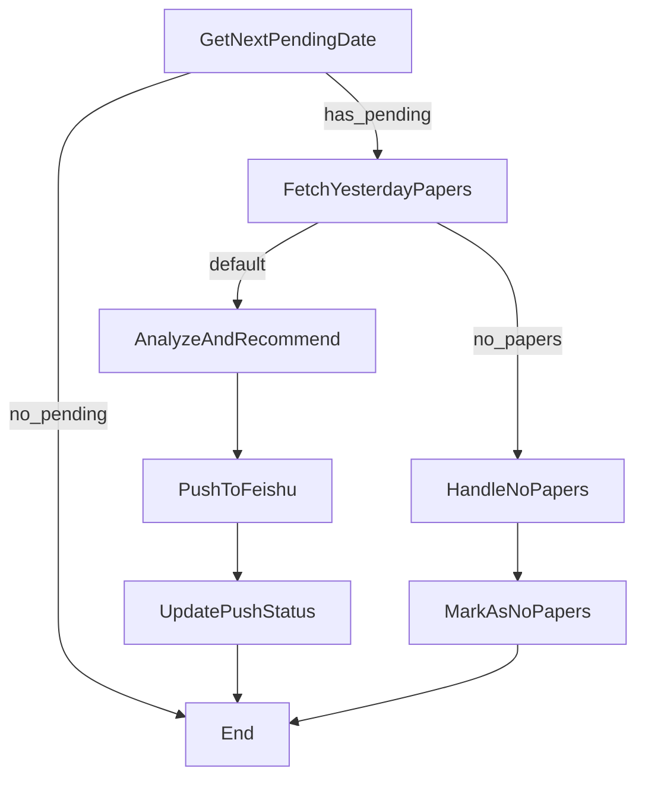

# 每日汇总工作流文档

## 概述

每日汇总工作流是一个用于处理历史未推送日报的自动化系统。它能够：

1. **跟踪推送状态**: 记录每日日报的推送状态，确保幂等性
2. **逐日处理**: 从最老的未推送日期开始，逐日生成和推送日报  
3. **复用现有节点**: 复用 `FetchYesterdayPapersNode` 和 `AnalyzeAndRecommendPapersNode`
4. **错误处理**: 优雅处理没有论文或推送失败的情况

## 核心组件

### 1. 报告跟踪器 (`ReportTracker`)
- 位置: `daily_paper/utils/report_tracker.py`
- 功能: 跟踪日报推送状态，维护推送历史
- 存储: `data/report_tracker.json`

### 2. 工作流节点
- `GetNextPendingDateNode`: 获取下一个待推送的日期
- `FetchYesterdayPapersNode`: 获取指定日期的论文（已修改支持动态日期）
- `AnalyzeAndRecommendPapersNode`: 分析和推荐论文（复用现有）
- `PushDailyReportToFeishuNode`: 推送到飞书（复用现有）
- `UpdatePushStatusNode`: 更新推送状态
- `HandleNoPapersNode`: 处理没有论文的情况

### 3. 工作流程 (`DailySummaryFlow`)
- 位置: `daily_paper/flows/daily_summary_flow.py`
- 功能: 协调各个节点，实现完整的日报生成流程

## 使用方法

### 1. 查看推送状态

```bash
python main_daily_summary.py --config-path config/rag.yaml --mode status
```

显示：
- 总推送统计
- 成功率
- 最后推送日期
- 待推送日期列表

### 2. 单次处理

处理一个待推送的日期：

```bash
python main_daily_summary.py --config-path config/rag.yaml --mode single
```

### 3. 批量处理  

处理多个待推送的日期：

```bash
python main_daily_summary.py --config-path config/rag.yaml --mode batch
```

### 4. 覆盖配置参数

使用命令行参数覆盖配置文件中的设置：

```bash
python main_daily_summary.py \
    --config-path config/rag.yaml \
    --mode batch \
    --max-days 10
```

## 工作流程图



## 配置文件

每日汇总工作流的配置已集成到现有的配置系统中。在 `config/rag.yaml` 或 `config/kg.yaml` 中配置：

```yaml
# 每日汇总工作流配置
daily_summary_enabled: true                              # 启用每日汇总功能
daily_summary_tracker_file: "data/rag_report_tracker.json" # 推送跟踪文件路径
daily_summary_max_days: 7                               # 批量模式下最多处理天数
daily_summary_recommendation_count: 3                   # 推荐论文数量
daily_summary_default_start_days_ago: 7                 # 默认开始处理几天前
daily_summary_skip_no_paper_dates: true                 # 跳过没有论文的日期
daily_summary_continue_on_push_failure: true            # 推送失败时继续下一天
```

### 配置说明

- **daily_summary_enabled**: 必须设置为 `true` 才能使用每日汇总功能
- **daily_summary_tracker_file**: 不同配置文件使用不同的跟踪文件，避免冲突
- **daily_summary_recommendation_count**: 覆盖分析节点的默认推荐数量
- 其他配置项继承现有的设置（如 `meta_file_path`、`feishu_webhook_url` 等）

## 幂等性保证

1. **状态跟踪**: 每个日期的处理状态都会被记录
2. **重复检查**: 运行前检查该日期是否已成功推送
3. **失败重试**: 推送失败的日期可以重新处理
4. **无论文标记**: 没有论文的日期会被标记，避免重复尝试

## 错误处理

### 1. 没有论文
- 标记为"无论文"状态
- 不会重复尝试该日期
- 继续处理下一天

### 2. 推送失败
- 记录失败状态和错误信息
- 可以重新运行来重试失败的日期
- 提供回退方案

### 3. 系统错误
- 详细的错误日志
- 优雅的错误恢复
- 保持数据一致性

## 监控和维护

### 日志位置
- 主程序日志: 控制台输出
- 详细日志: `logs/daily_summary.log` (如果配置)

### 数据文件
- 推送跟踪: `data/report_tracker.json`
- 论文数据: `data/papers.parquet`

### 定期任务建议
1. 每天运行一次单次模式
2. 每周运行一次批量模式检查遗漏
3. 定期备份跟踪文件

## 集成到现有系统

### 1. 作为独立工具
```bash
# RAG论文日报定时任务 (crontab)
0 9 * * * cd /path/to/daily-paper-v2 && python main_daily_summary.py --config-path config/rag.yaml --mode single

# 知识图谱论文日报定时任务
0 10 * * * cd /path/to/daily-paper-v2 && python main_daily_summary.py --config-path config/kg.yaml --mode single
```

### 2. 集成到现有工作流
```python
from daily_paper.config import Config
from daily_paper.flows import DailySummaryRunner
from daily_paper.utils.data_manager import PaperMetaManager

# 加载配置
config = Config.from_yaml("config/rag.yaml")

# 创建共享数据
shared = {
    "paper_manager": PaperMetaManager(config.meta_file_path),
    "config": config
}

# 运行每日汇总
runner = DailySummaryRunner(tracker_file=config.daily_summary_tracker_file)
result = runner.run_single(shared)
```

### 3. API 调用
可以轻松包装为 REST API 或其他接口形式。

## 常见问题

### Q: 如何重置推送状态？
A: 删除 `data/report_tracker.json` 文件，系统会重新创建。

### Q: 如何跳过某个日期？
A: 手动编辑跟踪文件，将该日期标记为已推送。

### Q: 推送失败如何处理？
A: 重新运行工作流，系统会自动重试失败的日期。

### Q: 如何更改推送目标？
A: 修改飞书配置或实现新的推送节点。

## 扩展性

该工作流设计具有良好的扩展性：

1. **新的推送渠道**: 添加新的推送节点
2. **自定义分析**: 替换或扩展分析节点  
3. **多配置支持**: 支持不同的配置文件
4. **API 集成**: 可包装为 API 服务