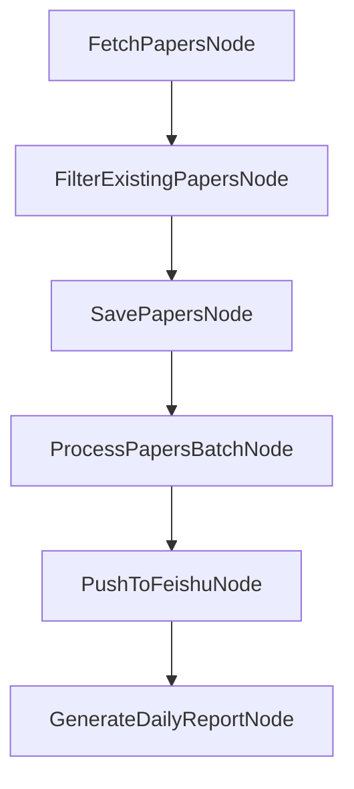

# Design Doc: Daily Paper Processing System

> 基于PocketFlow框架的学术论文自动化处理系统

## Requirements

### 用户故事
- 作为研究者，我希望能自动获取最新的RAG和知识图谱相关论文
- 作为研究者，我希望能自动生成论文摘要并推送到飞书群
- 作为研究者，我希望能自动生成每日研究简报

### 核心功能需求
1. **论文获取**: 从arXiv自动获取指定领域的最新论文
2. **智能过滤**: 过滤已处理的论文，避免重复处理
3. **摘要生成**: 使用LLM自动生成论文摘要
4. **消息推送**: 将论文和摘要推送到飞书群
5. **日报生成**: 生成每日研究趋势简报

## Flow Design

### 适用的设计模式

1. **Workflow**: 主要流程是线性的任务链，符合工作流模式
2. **MapReduce**: 论文处理部分采用批量处理模式，每篇论文独立处理后汇总
3. **Batch**: 多篇论文需要并行处理，提高处理效率

### Flow高级设计

1. **FetchPapersNode**: 从arXiv获取论文数据
2. **FilterExistingPapersNode**: 过滤已存在的论文
3. **SavePapersNode**: 保存论文元数据到parquet文件
4. **ProcessPapersBatchNode**: 批量处理论文（下载PDF+提取文本+生成摘要）
5. **PushToFeishuNode**: 推送论文到飞书群
6. **GenerateDailyReportNode**: 生成并推送日报



## Utility Functions

基于Flow设计，识别并实现必要的工具函数：

1. **ArXiv Client** (`daily_paper/utils/arxiv_client.py`)
   - *Input*: query (str), max_results (int)
   - *Output*: Dict[str, ArxivPaper]
   - *作用*: 封装arXiv API调用，获取论文数据

2. **PDF Processor** (`daily_paper/utils/pdf_processor.py`)
   - *Input*: paper_url (str), paper_id (str)
   - *Output*: extracted_text (str)
   - *作用*: 下载PDF文件并提取文本内容

3. **Feishu Client** (`daily_paper/utils/feishu_client.py`)
   - *Input*: paper (ArxivPaper), summary (str)
   - *Output*: success (bool)
   - *作用*: 发送消息到飞书群

4. **Data Manager** (`daily_paper/utils/data_manager.py`)
   - *Input*: papers (Dict), meta_file (str)
   - *Output*: DataFrame
   - *作用*: 数据存储和读取管理

5. **LLM Client** (`daily_paper/utils/call_llm.py`)
   - *Input*: prompt (str)
   - *Output*: response (str)
   - *作用*: 调用LLM生成摘要和日报

## 共享存储设计

为了最小化数据冗余，共享存储结构设计如下：

```python
shared = {
    "query_params": {
        "query": str,               # 搜索查询
        "max_results": int,         # 最大结果数
        "meta_file": str           # 元数据文件路径
    },
    "lm": dspy.LM,                 # LLM对象
    "raw_papers": dict,            # 从arXiv获取的原始论文数据
    "new_papers": dict,            # 过滤后的新论文
    "processed_papers": DataFrame,  # 已处理的论文数据
    "summaries": dict,             # 论文摘要
    "push_results": list,          # 推送结果
    "daily_report": str,           # 日报内容
    "daily_report_sent": bool      # 日报推送状态
}
```

## Node设计

### Node步骤详细说明

1. **FetchPapersNode**
  - *目的*: 从arXiv获取论文数据
  - *类型*: Regular Node
  - *步骤*:
    - *prep*: 从共享存储读取"query_params"
    - *exec*: 调用arxiv_client工具函数获取论文
    - *post*: 将论文数据写入"raw_papers"

2. **FilterExistingPapersNode**
  - *目的*: 过滤已存在的论文
  - *类型*: Regular Node
  - *步骤*:
    - *prep*: 从共享存储读取"raw_papers"和"meta_file"
    - *exec*: 调用data_manager过滤函数
    - *post*: 将过滤后的论文写入"new_papers"

3. **SavePapersNode**
  - *目的*: 保存论文元数据
  - *类型*: Regular Node
  - *步骤*:
    - *prep*: 从共享存储读取"new_papers"
    - *exec*: 调用data_manager保存函数
    - *post*: 加载完整数据到"processed_papers"

4. **ProcessPapersBatchNode**
  - *目的*: 批量处理论文
  - *类型*: Batch Node
  - *步骤*:
    - *prep*: 返回需要处理的论文列表
    - *exec*: 对每篇论文下载PDF并生成摘要
    - *post*: 批量更新论文摘要到"summaries"

5. **PushToFeishuNode**
  - *目的*: 推送论文到飞书
  - *类型*: Regular Node
  - *步骤*:
    - *prep*: 获取需要推送的论文列表
    - *exec*: 批量推送论文到飞书
    - *post*: 更新推送状态到"push_results"

6. **GenerateDailyReportNode**
  - *目的*: 生成并推送日报
  - *类型*: Regular Node
  - *步骤*:
    - *prep*: 获取今日论文数据
    - *exec*: 调用LLM生成日报
    - *post*: 推送日报到飞书

## 重构优势

相比原有的单体函数架构，PocketFlow重构提供了以下优势：

1. **模块化设计**: 每个Node职责单一，易于理解和维护
2. **错误处理**: 利用Node的内置重试机制，提高系统鲁棒性
3. **数据流清晰**: 通过共享存储明确数据流向，避免参数传递混乱
4. **可扩展性**: 新增功能只需添加新的Node，不影响现有逻辑
5. **可测试性**: 每个Node和工具函数都可以独立测试
6. **并行处理**: BatchNode自动处理并行任务，提高处理效率

## 使用方式

```bash
# 处理RAG相关论文
python main.py --task rag

# 处理知识图谱相关论文
python main.py --task kg
```

## 文件结构

```
daily-paper-v2/
├── main.py                    # 主入口
├── daily_paper/
│   ├── __init__.py
│   ├── nodes.py              # 所有Node定义
│   ├── flow.py               # Flow定义和连接
│   └── utils/
│       ├── __init__.py
│       ├── arxiv_client.py   # arXiv API客户端
│       ├── pdf_processor.py  # PDF处理工具
│       ├── feishu_client.py  # 飞书客户端
│       ├── data_manager.py   # 数据管理工具
│       └── call_llm.py       # LLM调用工具
├── docs/
│   └── design.md             # 设计文档
└── requirements.txt          # 依赖包
```
