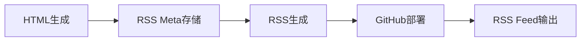
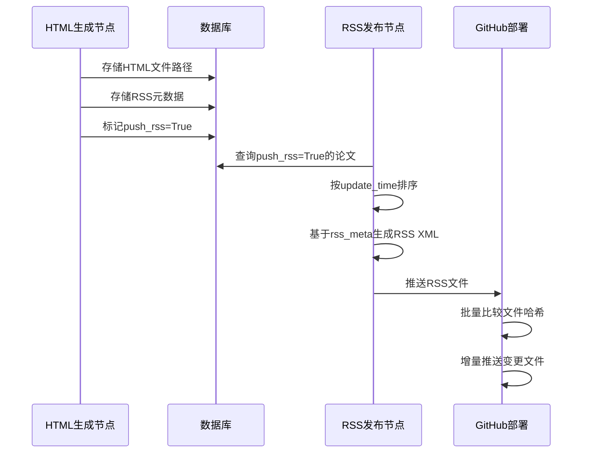

# RSS Feed 设计文档

## 概述

Daily Paper V2 项目实现了基于增量更新的RSS订阅功能，为用户提供最新的论文摘要和分析。RSS系统设计遵循标准RSS 2.0规范，支持高效的增量更新和批量部署。

## 系统架构

### 核心组件



1. **HTML Generation Node** - 生成论文HTML页面并存储RSS元数据
2. **RSS Publishing Node** - 基于存储的元数据生成RSS feed
3. **GitHub Deploy Node** - 批量部署RSS和HTML文件到GitHub Pages

## 数据结构设计

### ArxivPaper Model 扩展

```python
class ArxivPaper(BaseModel):
    # ... 原有字段
    rss_meta: str | None = None  # RSS元数据JSON字符串
```

### RSS Meta 数据格式

```json
{
    "title": "论文标题",
    "url": "/posts/2025-07-31-2507.23588v1.html",
    "description": "AI 论文: 关于深度学习的研究",
    "category": "AI Research",
    "pub_date": "2025-07-31",
    "content": "<h2>论文标题</h2><p>查看完整的论文分析和摘要。</p>",
    "filename": "2025-07-31-2507.23588v1.html"
}
```

## RSS Feed 特性

### 标准RSS 2.0结构

```xml
<?xml version="1.0" encoding="utf-8"?>
<rss version="2.0" xmlns:content="http://purl.org/rss/1.0/modules/content/">
  <channel>
    <title>Daily AI Papers</title>
    <link>https://example.github.io</link>
    <description>每日AI论文精选与分析</description>
    <language>zh-CN</language>
    <lastBuildDate>Mon, 04 Aug 2025 12:00:00 +0000</lastBuildDate>
    
    <item>
      <title>论文标题</title>
      <link>https://example.github.io/posts/2025-07-31-paper.html</link>
      <description>论文摘要描述</description>
      <category>AI Research</category>
      <pubDate>Thu, 31 Jul 2025 00:00:00 +0000</pubDate>
      <guid>https://example.github.io/posts/2025-07-31-paper.html</guid>
      <content:encoded><![CDATA[
        <h2>论文标题</h2>
        <p>查看完整的论文分析和摘要。</p>
      ]]></content:encoded>
    </item>
  </channel>
</rss>
```

### RSS内容策略

**摘要式设计**（当前采用）：
- ✅ 提供论文标题和简短描述
- ✅ 包含指向完整分析页面的链接
- ✅ 遵循业界标准实践（Medium、GitHub Blog等）
- ✅ 保持RSS文件大小合理
- ✅ 引导用户访问完整内容页面

## 增量更新机制

### 设计原理

1. **元数据驱动**：RSS生成基于数据库中存储的`rss_meta`字段
2. **时间排序**：按论文`update_time`排序，确保最新内容优先
3. **数量限制**：默认限制100篇论文，避免RSS文件过大
4. **原子更新**：HTML生成和RSS元数据存储在同一事务中

### 实现流程



## 性能优化策略

### 1. 数据库层优化

- **字段索引**：在`update_time`和`push_rss`字段上建立索引
- **批量操作**：使用批量更新减少数据库IO
- **JSON存储**：RSS元数据以JSON格式存储，避免复杂查询

### 2. RSS生成优化

- **避免XML解析**：不解析现有RSS文件，直接基于数据库重建
- **内存生成**：使用feedgen库在内存中构建RSS结构
- **增量查询**：只查询需要推送的论文记录

### 3. 部署优化

- **批量API**：使用GitHub Tree API批量获取远程文件信息
- **内容比较**：基于SHA哈希比较文件内容，避免重复推送
- **原子提交**：所有文件变更在单个commit中完成

## 文件命名策略

### HTML文件命名

```
格式：{update_date}-{paper_id}.html
示例：2025-07-31-2507.23588v1.html
```

**优势**：
- 时间前缀便于排序和管理
- 包含paper_id避免冲突
- 支持同一论文的多个版本

### RSS文件

```
固定文件名：rss.xml
位置：/public/rss.xml
```

## 配置参数

### RSS发布节点配置

```yaml
rss_config:
  title: "Daily AI Papers"
  description: "每日AI论文精选与分析"
  language: "zh-CN"
  max_items: 100
  site_url: "https://username.github.io"
```

### GitHub部署配置

```yaml
github_config:
  repo_owner: "username"
  repo_name: "username.github.io"
  token: "${GITHUB_TOKEN}"
  batch_upload: true
```

## 监控和日志

### 关键指标

- RSS生成耗时
- 文件推送数量
- API调用次数
- 增量比较效果

### 日志记录

```python
logger.info(f"RSS生成完成，包含 {item_count} 篇论文")
logger.info(f"批量推送完成，共推送 {pushed_count} 个文件")
logger.debug(f"文件内容相同，跳过推送: {filename}")
```

## 错误处理

### RSS生成容错

- JSON解析失败时跳过该论文
- 缺失字段时使用默认值
- 生成失败时记录错误并继续

### 部署容错

- 批量推送失败时自动回退到单文件推送
- 网络超时时进行重试
- API限制时进行退避重试

## 扩展规划

### 未来可能的改进

1. **多格式支持**：支持Atom格式
2. **分类RSS**：按论文类别生成多个RSS feed
3. **自定义过滤**：支持基于关键词的RSS订阅
4. **缓存机制**：实现RSS文件的本地缓存
5. **CDN集成**：通过CDN加速RSS访问

## 相关文件

- `daily_paper/model/arxiv_paper.py` - 数据模型定义
- `daily_paper/nodes/generate_html_node.py` - HTML生成和RSS元数据存储
- `daily_paper/nodes/publish_rss_node.py` - RSS生成逻辑
- `daily_paper/nodes/deploy_github_node.py` - GitHub部署和批量推送
- `daily_paper/utils/data_manager.py` - 数据管理工具

---

*文档版本：v1.0 | 最后更新：2025-08-04*